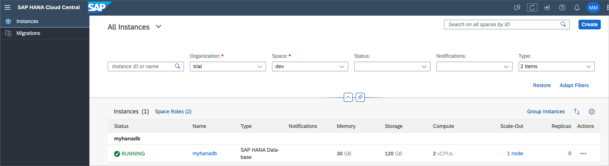
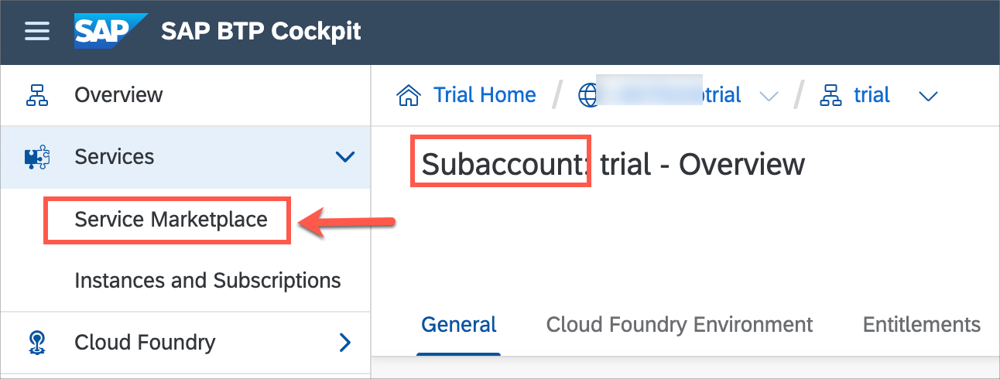

# Getting Started

**Before starting on the session exercises, please make sure that you have your BTP subaccount created in `US East (VA) - AWS [cf-us10]` region. You will be using SAP HANA Cloud service in this session which is available in the mentioned region only.**

  

Once you have your BTP subaccount setup in the required region, please start completing below pre-requisites.

- [Getting Started](#getting-started)
    - [Add SAP HANA Cloud to your existing BTP trial](#add-sap-hana-cloud-to-your-existing-btp-trial)
    - [Set Up SAP Business Application Studio for SAP CAP and MDK development](#set-up-sap-business-application-studio-for-sap-cap-and-mdk-development)
    - [Clone the TechEd session repository](#clone-the-teched-session-repository)
    - [Set Up Initial Configuration for an MDK App](#set-up-initial-configuration-for-an-mdk-app)
    - [Download SAP Mobile Services Client on your device](#download-sap-mobile-services-client-on-your-device)
  - [Summary](#summary)
  
### Add SAP HANA Cloud to your existing BTP trial

1. In the [SAP BTP trial cockpit](https://account.hanatrial.ondemand.com/trial), navigate to your subaccount.

2. Click on **Entitlements** on the left-hand side menu.
  
    

3. 	Make sure you have entitlements for the services (and service plans) listed here:

    - SAP HANA Cloud:  `hana-cloud-connection`, `hana`, and `relational-data-lake`

    -	SAP HANA Schemas & HDI Containers: `hdi-shared`, `schema`, `sbss`, and `securestore`

    

    If you already have the required entitlements added in your trial account, continue with step 8 to create your trial instance of SAP HANA Cloud, SAP HANA database.
    If you don't have the required entitlements in your trial account, continue with next step.

4. If you do not have any of the entitlements above, you need to add them to your account. To do that, click on **Configure Entitlements** on the top right-hand corner of the screen. 

    

5. Click on **Add Service Plans** in the same area of the screen.
  
    

6. In the pop-up that opens, type `HANA` in the search box to see all relevant entitlements. Select all the available plans for the highlighted entitlements (**SAP HANA Cloud** and **SAP HANA Schemas & HDI Containers**) and click on **Add X service Plans**

    

    >The reason not to select the SAP HANA Schemas & HDI Containers (trial) entitlement is that it is made for a trial of SAP HANA Service, not SAP HANA Cloud.

7. On the top right-hand side of the screen, make sure to click on **Save**.
   
    

    You have now added the SAP HANA Cloud entitlement to your existing trial account on SAP BTP! You will now create your trial instance of SAP HANA Cloud, SAP HANA database.

8. Navigate to your SAP BTP Cockpit and click on your space under `Spaces`.

    

9. On the menu on left-side of the screen, click on **SAP HANA Cloud** > **Create** > **SAP HANA database**.
  
    

9. A new tab will open in **SAP HANA Cloud Central**, choose **SAP HANA Cloud, SAP HANA Database** instance and click on **Next Step** to continue.

    

10. Provide an Instance name, Administrator Password, and Confirm Administrator Password. Click on **Next Step**.

  

11. In the **SAP HANA Database** step, keep the default memory and click on **Next Step**.

  

12. **SAP HANA Database Availability Zone and Replicas** is not applicable in BTP trial, click on **Next Step**.

  
    
13. In the **SAP HANA Database Advanced Settings** step, make sure to select **Allow all IP addresses** and click on **Next Step**.

  

14. In the **Data Lake** step, keep the default configuration as it is and click on **Review and Create**. 

  

15. Review the instance information and click on **Create Instance**.
      
  

  Your HANA cloud instance will start creating. Please be patience, it will be in Running status shortly. 
  

  Please remember: 
  * If you are using a free tier model or trial account, you will only be able to create one instance with a predefined size (30GB of memory, 2vCPUs, and 120GB of storage). However, the process to create the instance is very similar to what you will in a production environment.
  * Free tier model and trial instances will be stopped every day around midnight in the time zone of the server location you selected. Each time you start working with your free tier model or trial instance, you need to restart it.
  * If you do not restart your instances within 60 days, they will be deleted. Your BTP account, however, will continue to exist and you can easily provision an instance again, if you wish to do so.

### Set Up SAP Business Application Studio for SAP CAP and MDK development

1. Launch SAP Business Application Studio in any one of the [supported browsers](https://help.sap.com/docs/SAP%20Business%20Application%20Studio/9d1db9835307451daa8c930fbd9ab264/8f46c6e6f86641cc900871c903761fd4.html#availability). You can access it from https://account.hanatrial.ondemand.com 

  

  >You can also access it via SAP BTP cockpit > Service Marketplace. 
  

  A new tab opens. If you have not created a dev space, the welcome page for SAP Business Application Studio loads. 

  

  >If this is not the first dev space, the dev space manager for SAP Business Application Studio loads. 

  

2. Click on **Create Dev Space**. 
   
   Provide a name for your dev space, select **SAP Mobile Application** as the application type. Select **CDS Graphical Modeler** and **CAP Tools** as additional SAP Extensions. Continue with **Create Dev Space**.

  

3. When it’s ready, open your dev space by clicking on the name.  

  

### Clone the TechEd session repository

Before starting on the session exercises, we will clone the session git repository into the Business Application Studio workspace.

1. From the Get Started page select `Clone from Git`.

  

  >If you do not see the `Get Started` page, you can access it by typing `>get started` in the center search bar.

  

2. In the `Provide repository URL` field, copy and paste the URL https://github.com/SAP-samples/teched2022-AD181 to the session repository and press **Enter**.

  

3. When the clone is completed, click the X to close the notification popup.

  

### Set Up Initial Configuration for an MDK App

You will create initial app configuration in SAP Mobile Services cockpit.

1. In the [SAP BTP trial cockpit](https://account.hanatrial.ondemand.com/trial), navigate to your subaccount and click on it.
  
  

2. In the left pane, choose **Services → Service Marketplace**.

  

3. Search for **Mobile** and click **Mobile Services** tile.

  

4. Choose **Support** to open **SAP Mobile Services Cockpit**.
   
    

    >If you don't see `Support` link, make sure you are in sub-account level, not in space level.
     
5. If you are asked to sign in, then enter your Email or Username to continue and click **Next**.

6. Choose the relevant **Organization** and **Space** from the dropdown list, and then select **Open**.

    

    >- If you do not see any option in the dropdown list, please check whether your Cloud Foundry environment is an extended landscape. To do so, check the `API Endpoint` value for the Cloud Foundry organization on your SAP BTP cockpit overview page. 
    >    
    >- If the `API Endpoint` includes "-00X" (where 'X' is a number e.g., https://api.cf.us10-001.hana.ondemand.com ), the Cloud Foundry organization is running on an extended Cloud Foundry landscape. 
    >- In your SAP BTP cockpit, navigate to `Services` |  `Instances and Subscriptions`, and then create a **Mobile Services** instance.
      >      
      >      
    >- Once a new Mobile Services instance is created, click on 3 dots icon and select the **Open Dashboard** link to open the SAP Mobile Services cockpit. 
      >      
    >- Choose your identity provider if asked. The SAP Mobile Services cockpit page opens. Restore the app to repair it if needed. 
      >    
    >- If you see `No Organization exists` error, clear your browser cache and try again lauching the SAP Mobile Services cockpit via `Open Dashboard` option.  

7. Once you have logged in to the SAP Mobile Services cockpit, click **Create new app** on the `Home` page or navigate to **Mobile Applications | Native/MDK | New**.

    

8. In the **Basic Info** step, provide the required information and click **Next**.

    | Field | Value |
    |----|----|
    | `ID` | com.sap.teched.ad181 |
    | `Name` | SAP MDK App - TechEd 2022 AD181 |

     

9. In the **XSUAA Settings** step, continue with the default settings and click **Next** to navigate to further steps.

     

10. In the **Assign Features** step, choose **Mobile Development Kit Application** from the dropdown and then click **Finish**.

     

    >If you see a _Confirm Finish_ window, click **OK**.

     Once you have created your application, you see a list of default features have been automatically assigned to the app.

     

11. Click on the **Mobile Settings Exchange**, set **Lock Timeout** to 120 seconds. This value defines how long the application can be inactive before the user must re-enter his or her app passcode to continue using the application. 

    

Bookmark the **Mobile Services cockpit URL** for quick access as you will visit this page again for adding a destination. 

### Download SAP Mobile Services Client on your device

Download and install *SAP Mobile Services Client* on your Android or iOS device. 

  Android             |  iOS
:-------------------------:|:-------------------------:
Scan the below QR code on your device to download the client on the Google Play  | Scan the below QR code on your device to download the client on the App Store 

## Summary

You've now completed the pre-requisite to get started with the session exercises. 

Continue to - [Exercise 1 - Deploy a CAP Business Service to SAP Business Technology Platform](../ex1/README.md)
