# Exercise 1 - Deploy a CAP Business Service to SAP Business Technology Platform

In this exercise, you will deploy your SAP Cloud Application Programming Model (CAP) project to SAP Business Technology Platform (BTP), Cloud Foundry environment using SAP HANA Cloud service.

- [Exercise 1 - Deploy a CAP Business Service to SAP Business Technology Platform](#exercise-1---deploy-a-cap-business-service-to-sap-business-technology-platform)
    - [Exercise 1.1 - Change the workspace to the projects folder](#exercise-11---change-the-workspace-to-the-projects-folder)
  - [Exercise 1.2 -  Deploy CAP project to SAP Business Technology Platform](#exercise-12----deploy-cap-project-to-sap-business-technology-platform)
  - [Summary](#summary)


### Exercise 1.1 - Change the workspace to the projects folder

Switch your workspace to the `projects` folder.

1. Click on the Explorer icon and click  **Open Folder**.

    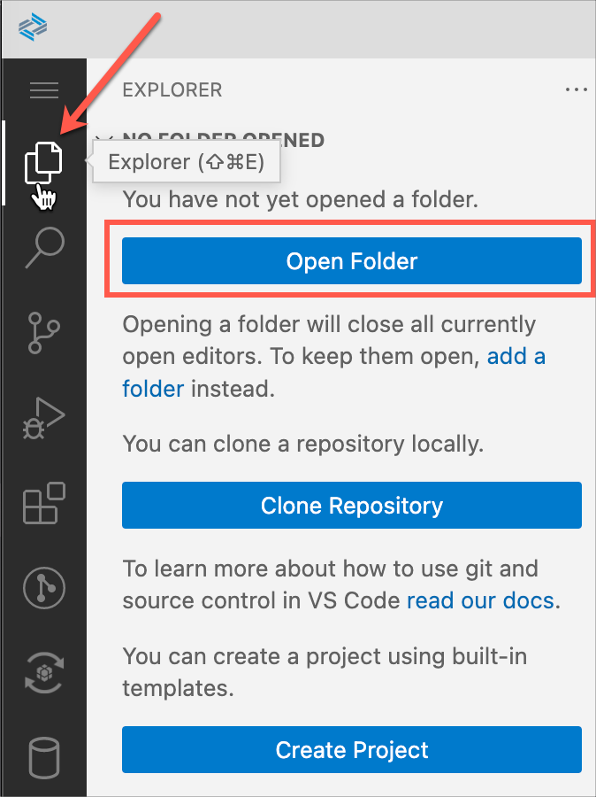

2. Select the `projects` folder if not already selected and click **OK**.

    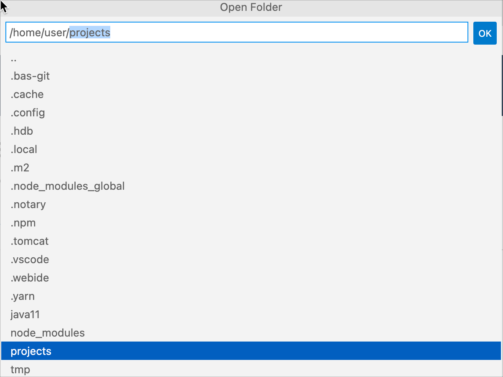

    The BAS page reloads in the browser and you will now see the PROJECTS folder is opened as the workspace.

    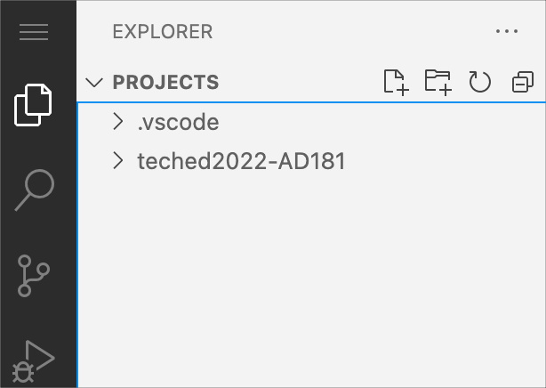

## Exercise 1.2 -  Deploy CAP project to SAP Business Technology Platform

>Before you deploy the CAP project, please make sure that your HANA cloud instance is up and running.
>  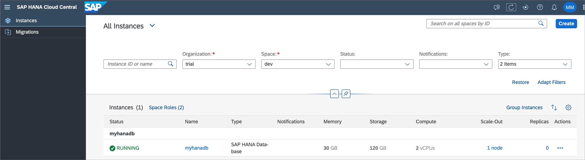

1. Navigate to `Terminal` menu | `New Terminal`. 

    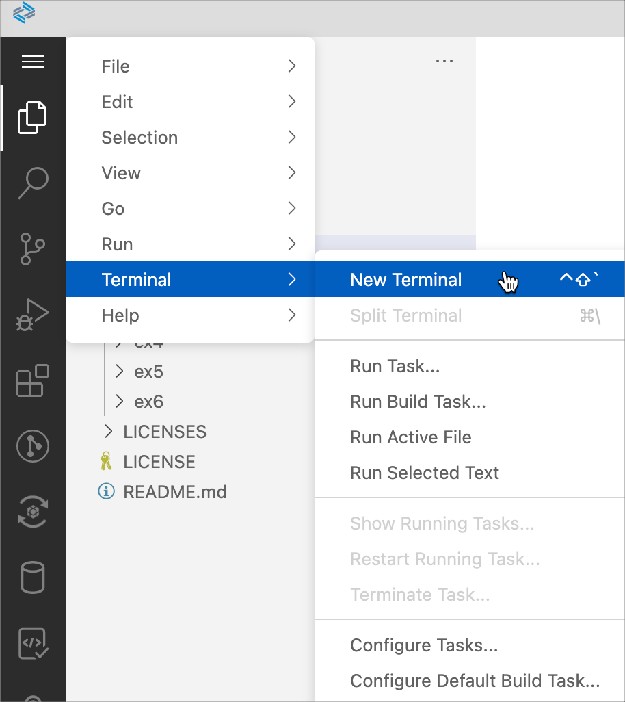

2. Execute below command to create a Cloud Foundry session. After successful login select your org and space.

    ```shell
    cf login
    ```

    OR execute below command if your user is configured with multi factor authentication. Enter your temporary authentication code from the passcode link.  

    ```shell
    cf login --sso
    ```

    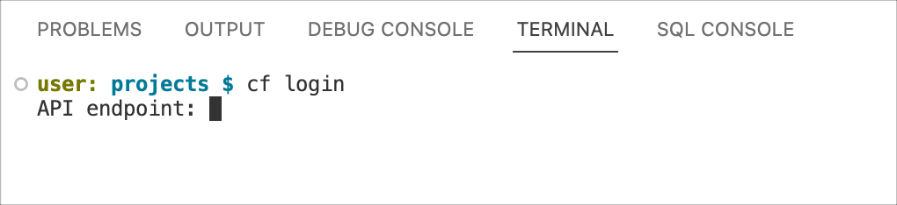  

    >You can get API endpoint from your Cloud Foundry account
    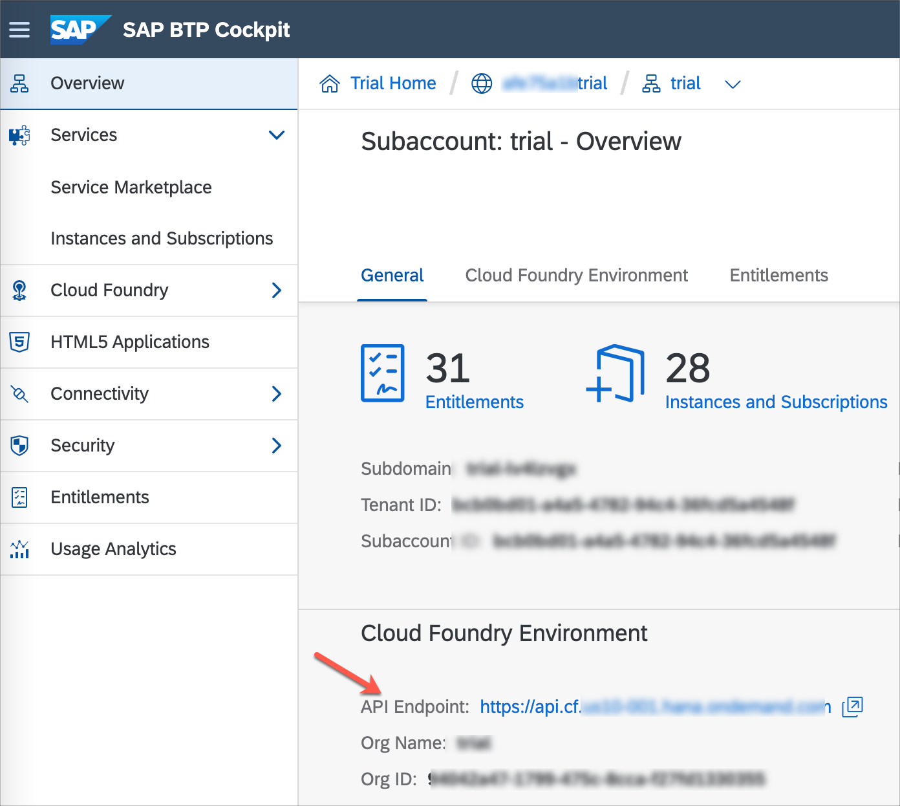 
   

3. Execute below command setting the current path to your CAP project.

    ```shell
    cd TechEd22-AD181/exercises/ex1/ESPM-main
    ```

4. Execute below script to deploy CAP project to SAP BTP.

    ```shell
    sh deployCFMTA.sh
    ```

     

    Once deployment process is finished, you will see a message about `ESPM-srv` application availability. 

    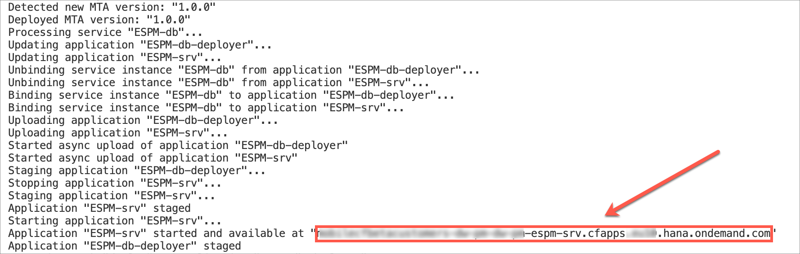 

    The highlighted URL in above screenshot is your service endpoint. Copy it and paste in a new tab in your browser. 

    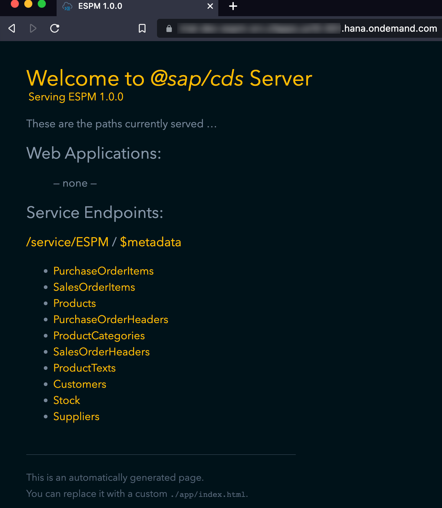 

    Service Endpoints list down various path to access information about e.g., service document, service metadata document and available entities.  
    
    In order to find the required destination for Mobile development, click on the `/service/ESPM` path. 

    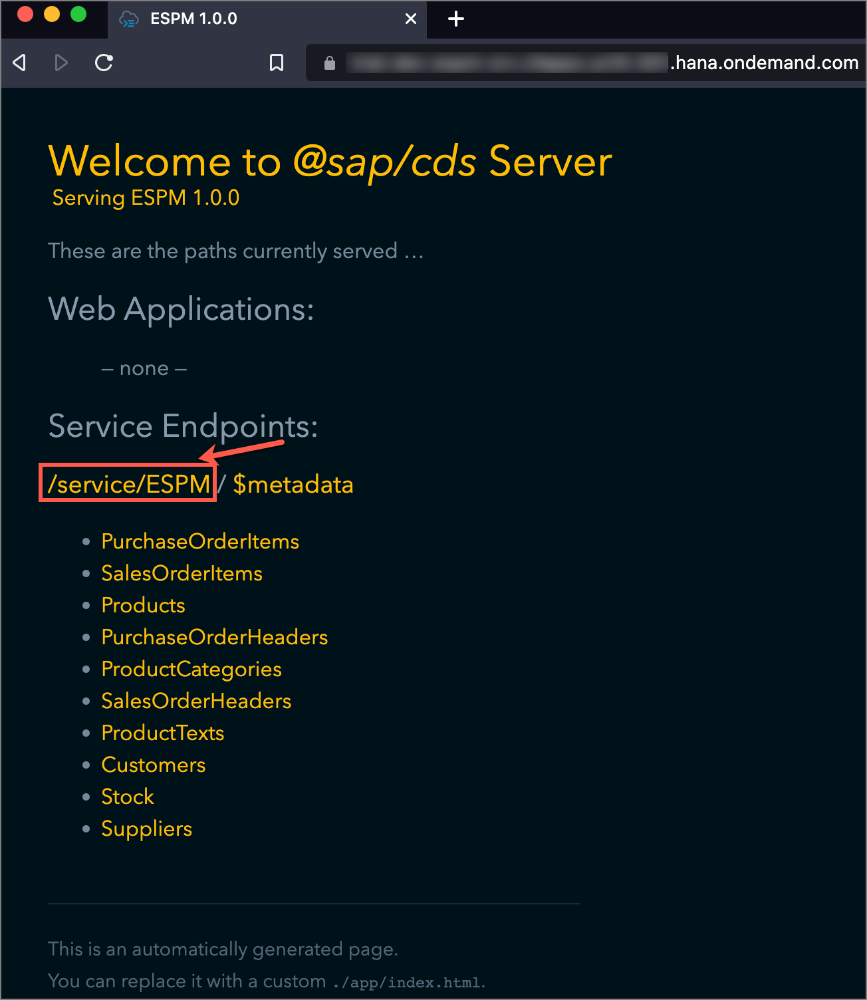 

    The resulted page displays list of Entity sets of your OData service. 

    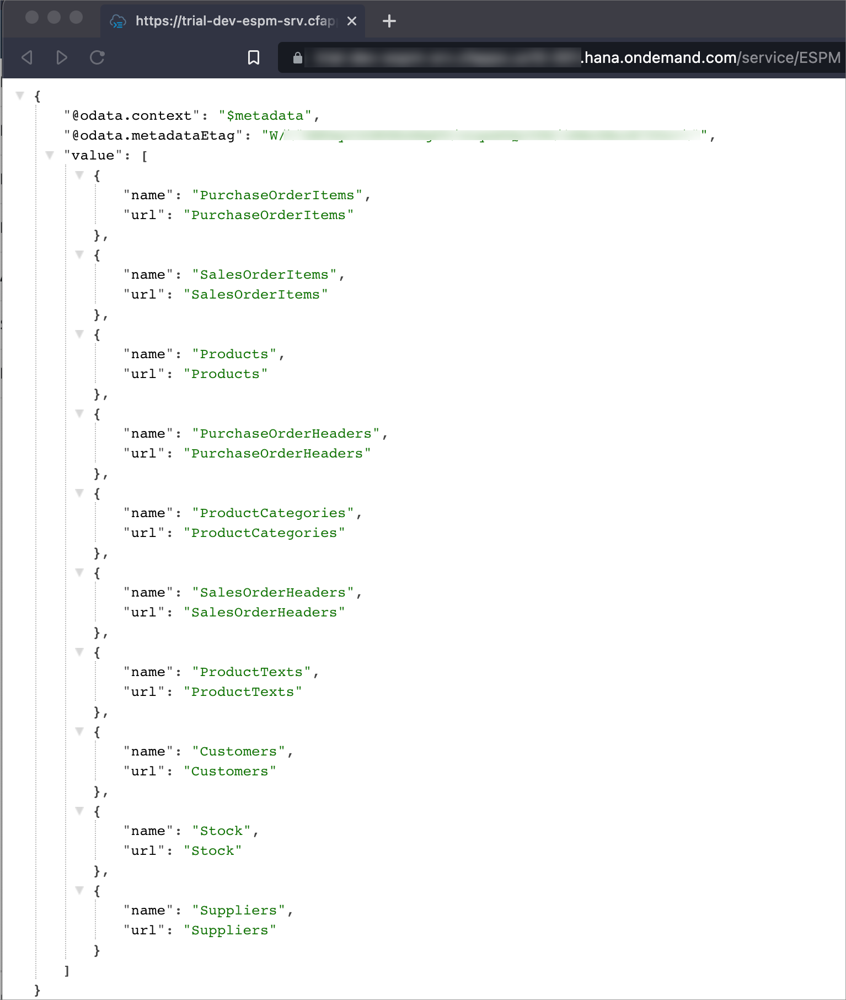 

    **Keep a note of this URL as you will configure this endpoint as a Destination in Mobile Services.**

    >If you see the output in Raw format, you may install any `JSON formatter` extension in your browser to get a parsed output in more structured way.

## Summary

You've now generated an OData service based on SAP Cloud Programming Model (CAP).

Continue to - [Exercise 2 - Create an application from the MDK template](../ex2/README.md)

