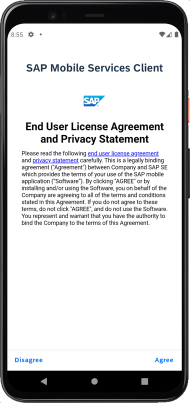
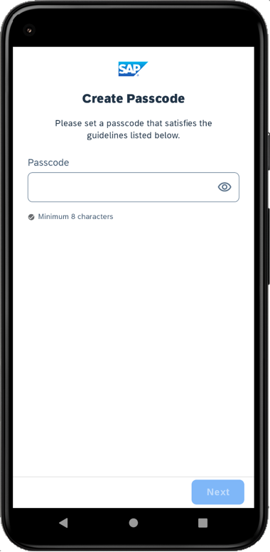
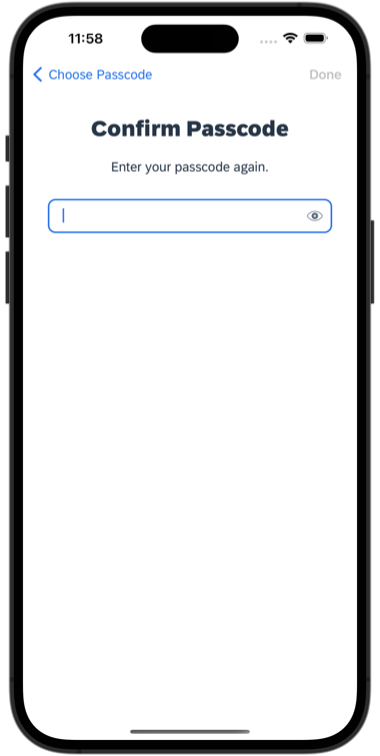

# Exercise 2 - Create an application from the MDK template

In this exercise, you will create an MDK application from a template.  
- [Exercise 2 - Create an application from the MDK template](#exercise-2---create-an-application-from-the-mdk-template)
    - [Exercise 2.1 - Configure your OData Service as a Destination in Mobile Services](#exercise-21---configure-your-odata-service-as-a-destination-in-mobile-services)
    - [Exercise 2.2 - Create the MDKApp project from a template](#exercise-22---create-the-mdkapp-project-from-a-template)
    - [Exercise 2.3 - Change the workspace to the projects folder](#exercise-23---change-the-workspace-to-the-projects-folder)
    - [Exercise 2.4 - Deploy the application](#exercise-24---deploy-the-application)
    - [Exercise 2.5 - Display the QR code for onboarding the Mobile app](#exercise-25---display-the-qr-code-for-onboarding-the-mobile-app)
    - [Exercise 2.6 - Run the app](#exercise-26---run-the-app)
  - [Summary](#summary)

### Exercise 2.1 - Configure your OData Service as a Destination in Mobile Services

1. Switch to the Mobile Services Cockpit. If your Mobile Services session has timed out, sign in again.
2. Navigate to the *SAP MDK App - TechEd 2022 AD181* (`com.sap.teched.ad181`) and select **Mobile Connectivity** under Assigned Features.

    

3. Click the **Create** icon to add a new destination.
   
    

4. In **Basic Info** step, provide the required information and click **Next**.

    | Field | Value |
    |----|----|
    | `Destination Name` | ESPM |
    | `URL` | Enter the service document URL from your CAP OData service |

    

5. For this exercise, there are no Custom Headers, Annotations, Destination Configuration or SSO Mechanism settings required. Click **Next** to navigate through the steps and click **Finish**.

6. You will now test this URL via Mobile Services to make sure it can be accessed and retrieving the data via Mobile Services. Click on the highlighted breadcrumb navigation `Mobile Connectivity` to go back to the previous page. 

    

7. Click on the `Launch in Browser` icon.     

    

    A new tab opens in your browser and the resulted output is the service document of your OData service (accessed via Mobile Services).

    

    >If you see the output in Raw format, you may install any `JSON formatter` extension in your browser to get a parsed output in more structured way.

8. Remove `?auth=uaa` in the URL and append an EntitySet e.g., `Products` to check related data. 

    

    Similarly, you can retrieve the data for other entities and execute other OData queries.   

### Exercise 2.2 - Create the MDKApp project from a template

1. Switch to your SAP Business Application Studio page. In your Dev space, click **Start from template** on Get Started page.
   
    

  >If you do not see the `Get Started` page, you can access it by typing `>get started` in the center search bar.

  

2. Select **MDK Project** and click **Start**.

    

    >If you do not see the **MDK Project** option check if your Dev Space has finished loading or reload the page in your browser and try again.

    >This screen will only show up when your CF login session has expired. Enter your login credentials, click Sign in. After succesful signed in to Cloud Foundry, select your Cloud Foundry Organization and Space where you have set up the initial configuration for your MDK app and click Apply. 
    >
    
    >- If you do not see any option in the dropdown list, please check whether your Cloud Foundry environment is an extended landscape. To do so, check the `API Endpoint` value for the Cloud Foundry organization on your SAP BTP cockpit overview page. 
    >    

3. In *Basic Information* step, provide the below information and click **Next**:

    | Field | Value |
    |----|----|
    | `MDK Template Type`| Select `CRUD` from the dropdown |
    | `Your Project Name` | Provide a name of your choice. `MDKApp` is used for this tutorial |
    | `Your Application Name` | <default name is same as project name, you can provide any name of your choice> |
    | `Target MDK Client Version` | Leave the default selection as `MDK 6.0+ (For use with MDK 6.0 or later clients)` |
    | `Choose a target folder` | By default, the target folder uses project root path. However, you can choose a different folder path |

    

4. In *Service configuration* step, provide the below information and click **Next**:

    | Field | Value |
    |----|----|
    | `Data Source` | Select `Mobile Services` from the dropdown |
    | `Mobile Services Landscape` | Select `standard` from the dropdown |
    | `Application Id` | Select `com.sap.teched.ad181` from the dropdown (this app was configured as per [prerequisite exercise](./../ex0/README.md#set-up-initial-configuration-for-an-mdk-app)) |
    | `Destination` | Select `ESPM` from the dropdown |
    | `Enter a path to service` | Leave it as it is |
    | `Enable Offline` | It's enabled by default |

    

    Regardless of whether you are creating an online or offline application, this step is needed for app to connect to an OData service. When building an MDK Mobile application, it assumes the OData service created and the destination that points to this service is set up in Mobile Services.

    Since we have Enable Offline set to Yes, the generated application will be offline enabled in the MDK Mobile client.

5. In the *Data Collections* step, choose **Yes** to select all data collections and then click **Finish** to complete the project creation.
   
    

    At the end of the creation process, the `MDKApp` will be opened as a workspace in Business Application Studio.

    

### Exercise 2.3 - Change the workspace to the projects folder

Switch your workspace to the `projects` folder.

1. Click on the hamburger icon,select **File** | **Open Folder**.

    

2. Set path to the `projects` folder if not already set and click **OK**.

    

    The projects folder is now open as the workspace.

        

### Exercise 2.4 - Deploy the application

So far, you have learned how to build an MDK application in the SAP Business Application Studio editor. Now, you will deploy the application definitions to Mobile Services to use it in the Mobile client.

1. Click the `MDKApp` to expand the project.  Right-click `Application.app` and select **MDK: Deploy**.

    

2. Select deploy target as **Mobile Services**. MDK editor will deploy the metadata to Mobile Services.

    

    If you want to enable source for debugging the deployed bundle, then choose Yes.

    

     You should see successful message for your deployment.

     

### Exercise 2.5 - Display the QR code for onboarding the Mobile app

SAP Business Application Studio has a feature to display the QR code for onboarding in the Mobile client.

Click the `Application.app` to open it in MDK Application Editor and then click the **Application QR Code** icon.

The On-boarding QR code is now displayed.

>Leave the Onboarding dialog box open for the next step.

### Exercise 2.6 - Run the app

| Steps      | Android | iOS     |
| :---        |    :----:   |          ---: |
| 1. Launch **`Mobile Svcs`** app on your mobile device. Tap **Agree** on `End User License Agreement`      |        |    |
| 2. Tap **Scan** to start the device camera for scanning the onboarding QR code. Please note, if you already have the MDK client on-boarded, tap *Get Started* and *Scan new QR code* to continue.  |        |    |
| 3. Once scan is succeeded, tap **Continue**.   |        |    |
| 4. Enter your credentials to login to SAP Business Technology Platform (BTP).   |        |     |
| 5. Choose a passcode with at least 8 characters for unlocking the app and tap **Next**.   |        |    |
| 6. Confirm the passcode and tap **Done**.   |        |    |
| 7. Optionally, you can enable Biometric authentication to get faster access to the app data, tap **Enable**.   |        |    |
| 8. Tap **Now** to accept the deployed metadata definitions.   |        |    |
|After you accept the app update, you will see the list of entities on the **Main** page, **Logout**, **Sync**, and **Update** options at bottom of the page and Offline store will be initialized.    |        |    |

Tap any entity, it navigates to a list page where you can create a new record.  If you select one of the items, the detail page will be displayed where you can  update and delete the record. This record gets saved to offline request queue database. You can navigate back to main page and press **Sync** to upload any local changes to the backend. Once the upload is successful, it will also download the data from the backend to the offline store to have the same dataset on both sides.

>Once you have scanned and on-boarded using the onboarding URL, it will be remembered. When you Log out and onboard again, you will be asked either to continue to use current application or to scan new QR code.

## Summary

You've now created and deployed your initial MDK application.

Continue to - [Exercise 3 - Enhance the generated Product List and add a Filter Bar on the Page](../ex3/README.md)