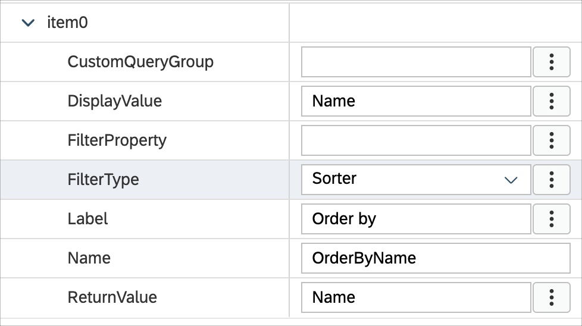

# Exercise 3 - Enhance the generated Product List and add a Filter Bar on the Page

In this exercise, you will enhance the generated Product List and will also add a Filter feedback bar that allows you to quickly apply frequently used filters. This Filter feedback bar will appear above the Product List.

- [Exercise 3 - Enhance the generated Product List and add a Filter Bar on the Page](#exercise-3---enhance-the-generated-product-list-and-add-a-filter-bar-on-the-page)
    - [Exercise 3.1 - Enhance the Products List page](#exercise-31---enhance-the-products-list-page)
    - [Exercise 3.2 - Add a Filter Feedback Bar on the page](#exercise-32---add-a-filter-feedback-bar-on-the-page)
    - [Exercise 3.3 - Redeploy the application](#exercise-33---redeploy-the-application)
    - [Exercise 3.4 - Update the MDK app with new metadata](#exercise-34---update-the-mdk-app-with-new-metadata)
  - [Summary](#summary)

### Exercise 3.1 - Enhance the Products List page

On the Product List page, you notice that 

- In the left column, there are duplicate information (e.g., Servers) for a given Product. These values actually belong to `Category` and `CategoryName` properties of Product Entity.  The test data for the Product entity have same values for those properties. 
- In the Right column, there are values like currency code and Depth dimension of the Product.
    Android             |  iOS
    :-------------------------:|:-------------------------:
      |  

    >Please note the screenshots in this exercise are from Phone device, if you are running your MDK client in Tablet device, the Description property will appear in second column. 

It would be more meaningful if displaying
- additional Product's dimensions e.g., Width, Height along with their unit instead of showing Depth only
- the Product's price with Currency code (formatter) instead of just currency code only and 

1. Navigate to `Pages` | `Products` | `Products_List.page`, select the Object Table control.
2. The control’s Description property is currently bound to the OData property *{Category}*. You'll replace this binding with Product's dimension. 
    * Click on the link icon for the **Description** property. It will open the Object browser.
    * Cut or remove the default expression in the object browser.
    * Double-click on `DimensionWidth`, you will see `{DimensionWidth}` binding generated in the expression box. **Do not close the Object Browser window**.
    * Put a space after the generated value, type  *x*
    * Put a space after the new value, select `DimensionDepth` and click on `Insert`. You will see `{DimensionWidth} x {DimensionDepth}` binding generated in the expression box.
    * Put a space after the new value, type *x*
    * Put a space after the new value, select `DimensionHeight` and click on `Insert`. You will see `{DimensionWidth} x {DimensionDepth} x {DimensionHeight}` binding generated in the expression box
    * Put a space after the new value, select `DimensionUnit` and click on `Insert`. The new expression should look like `{DimensionWidth} x {DimensionDepth} x {DimensionHeight} {DimensionUnit}`
    * Click **OK** to set the value to the control field.

        

3. Next, you'll update the control's Status property which is currently bound to the OData property *{CurrencyCode}*. You'll additionally add the Product price and format its value using the Currency formatter. 
   * In the Property pane, click **link** icon for the *Status* property.
   * Cut or remove the default expression in the object browser.
   * Select **i18n Objects** in the dropdown and then select **Currency** in the formatters dropdown.
   * Click **Insert** to generate the expression, **do not close the Object Browser window**.
        
        
        The generated expression looks like below:

        ```
        $(C,,,'',{minimumIntegerDigits:1,minimumFractionDigits:0,maximumFractionDigits:2,useGrouping:true})
        ```

    * You will now bind the Currency value placeholder with the *Price* property of the *Products* entity. Put the cursor before the second comma (from left side). Choose **OData Objects** option from the dropdown, select the **Price** property under the *Products* and click **Insert** to generate the expression, **do not close the Object Browser window**.
        
    
        The generated expression looks like below:

        ```
        $(C,{Price},,'',{minimumIntegerDigits:1,minimumFractionDigits:0,maximumFractionDigits:2,useGrouping:true})
        ```    

    * You will now bind the Currency Code placeholder with the *Currency Code* property of the *Products* entity. Put the cursor before the third comma (from left side). Select the **CurrencyCode** property under the *Products* and click **Insert** to generate the expression.
        
        The generated expression looks like below:

        ```
        $(C,{Price},{CurrencyCode},'',{minimumIntegerDigits:1,minimumFractionDigits:0,maximumFractionDigits:2,useGrouping:true})
        ```    

    * Click **OK** to set the value to the control field.
  
        >You can find more details on Currency formatter in [documentation](https://help.sap.com/doc/f53c64b93e5140918d676b927a3cd65b/Cloud/en-US/docs-en/guides/getting-started/mdk/development/property-binding/i18n-formatter.html#currency-formatter). 
    
4. Next, remove the default binding for the **Substatus** property and leave it blank.

    

### Exercise 3.2 - Add a Filter Feedback Bar on the page

Filter feedback bar is a horizontal bar that appears (on Sectioned Table) above a list of content. It uses area interactive chips to communicate which filters have been applied to the list and allows users to quickly apply frequently-used filters.

1. In the `Products_List.page`, navigate to the `Sectioned Table` as highlighted below.

    

2. In the Property pane, select **Object Collection** for the *FastFilters* property under *FilterFeebackBar* section.

    

3. Click **Add**. You will see *item0* object generated. 

    

4. Provide the below information:

    | Property | Value |
    |----|----|
    | `DisplayValue` | Name |
    | `FilterType` | Choose *Sorter* from the dropdown |    
    | `Label` | Order by |    
    | `Name` | OrderByName |
    | `ReturnValue` | Name |    

        

5. Add 3 more items to the *FastFilters*. 
   
       

6. Provide the below information for the second item: 

    | Property | Value |
    |----|----|
    | `DisplayValue` | Price |
    | `FilterType` | Choose *Sorter* from the dropdown |    
    | `Label` | Order by |    
    | `Name` | OrderByPrice |
    | `ReturnValue` | Price |    

       

7. Provide the below information for the third item: 

    | Property | Value |
    |----|----|
    | `CustomQueryGroup` | Height |
    | `DisplayValue` | > 30 |
    | `FilterType` | Choose *Filter* from the dropdown |    
    | `Label` | Height |    
    | `Name` | FilterByHeight |
    | `ReturnValue` | DimensionHeight gt 30 |    

       

8. Provide the below information for the last item: 

    | Property | Value |
    |----|----|
    | `CustomQueryGroup` | Category |    
    | `DisplayValue` | Notebooks |
    | `FilterProperty` | CategoryName | 
    | `FilterType` | Choose *Filter* from the dropdown |    
    | `Name` | FilterByCategoryName |
    | `ReturnValue` | Notebooks |    

       

9. Set true for *ShowAllFilters* property.    

     

### Exercise 3.3 - Redeploy the application

1. Right-click the `Application.app` file in the project explorer pane, select `MDK:Deploy` and then select deploy target as **Mobile Services**.

    
    

    >Alternatively, you can select *MDK: Redeploy* in the command palette (View menu>Command Palette OR press Command+Shift+p on Mac OR press Ctrl+Shift+P on Windows machine), it will perform the last deployment.
    >

### Exercise 3.4 - Update the MDK app with new metadata

Tap **Update** on the Main page, you will see a _New Version Available_ pop-up, tap **Now**. Tap on the **Products**, you will now see a Filter Bar appears above the Products List and there are some additional info showing in the list. 

  Android             |  iOS
:-------------------------:|:-------------------------:
  |  
  |  

## Summary

You've now enhanced the list page displaying some meaningful information and have also added a filter bar to do quick apply filters on the products list. 

Continue to - [Exercise 4 - Upload a Media to Product Entity](../ex4/README.md)
