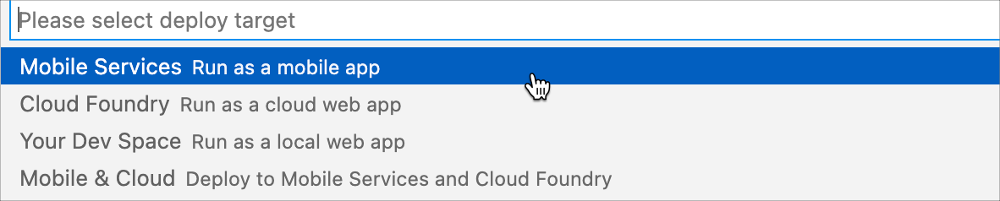

# Exercise 4 - Upload a Media to Product Entity

The Product entity is an OData media entity with OData property `Picture` with type `Edm.Stream`. The initial state of the generated CAP OData service doesn't have any media for any product.
You will update Product entity by uploading media to it.

- [Exercise 4 - Upload a Media to Product Entity](#exercise-4---upload-a-media-to-product-entity)
    - [Exercise 4.1 - Add a Generic Message Box](#exercise-41---add-a-generic-message-box)
    - [Exercise 4.1 - Add an Attachment Control on Product Edit Page](#exercise-41---add-an-attachment-control-on-product-edit-page)
    - [Exercise 4.2 - Validate Attachment before saving Product Entity](#exercise-42---validate-attachment-before-saving-product-entity)
    - [Exercise 4.3 - Bind Upload Stream Action to Product Update Entity Action](#exercise-43---bind-upload-stream-action-to-product-update-entity-action)

    - [Exercise 4.5 - Update the MDK app with new metadata](#exercise-45---update-the-mdk-app-with-new-metadata)
  - [Summary](#summary)


### Exercise 4.1 - Add a Generic Message Box

1. Right click on `Actions`, click `MDK: New Action` to create a new action.

    

2. Choose **MDK Message Actions** in **Category** | click **Message Action** | **Next**.    

    

3. Provide the below information:

    | Property | Value |
    |----|----|
    | `Action Name`| GenericMessageBox |
    | `Type` | Select `Message` from the dropdown |
    | `Message` | {Message} |
    | `Title` | {Title} |
    | `OKCaption` | {OKCaption} |
    | `OnOK` | `--None--` |
    | `CancelCaption` | leave it blank |
    | `OnCancel` | `--None--` |

    

4. Click **Next** and then **Finish** on the confirmation step.

### Exercise 4.2 - Add an Attachment Control on Product Edit Page

1. Navigate to `Pages` | `Products` | `Products_Edit.page`. The CRUD template automatically generates this page with every field from the Entity Set.
   
2. Drag and drop an **Attachment** control on the page area (e.g., just before the *Supplier_SupplierID* ListPicker control)
   
    

3. Provide the below information:          

    | Field | Value |
    |----|----|
    | `Name` | Picture |
    | `AttachmentActionType` | Unselect *SelectFile* option |
    | `AttachmentAddTitle` | Browse |
    | `AttachmentTitle` | Picture | 

    

4. If a Product already has a media, you may want to display it while updating the record. You can write a logic to get the current attachment. For the control's Value property, click on the **Create a rule** icon. 

    

5. Select *Object Type* as **Rule** and *Folders* as **/MDKApp/Rules/Products**. Click **OK**.
    
    

    >It is good to keep all releated files in same folder.

 6. Provide a Name **Products_GetCurrentAttachment** to your rule, Click **Next** and **Finish** the confirmation step. 
   
    

7. `Products_GetCurrentAttachment.js` file will open in code editor. Replace its content with below snippet: 

    ```javascript
    export default function Products_GetCurrentAttachment(context) {
        let pageProxy = context.getPageProxy();
        let readLink = context.binding['@odata.readLink'];
        //get OData cache image path
        return pageProxy.getODataCacheImagePath(`/MDKApp/Services/ESPM.service/${readLink}/Picture`).then((imagePath) => {
            if (imagePath) {
            const entitySet = 'Products';
            const property = 'Picture';
            const service = '/MDKApp/Services/ESPM.service';
            //createAttachmentEntry ClientAPI will create an object for attachment entry
            return [context.createAttachmentEntry(imagePath, entitySet, property, readLink, service)];
        } else {
            return [];
        }
        });
    }
    ```


 8. Since there is only one Stream property available for Product Entity, it is important to inform user in case he/she trying to attach more than one media. Navigate to the **Event** tab, Click on **Create a rule/action** for `OnValueChange` event.
  
    

9. Select *Object Type* as **Rule** and *Folders* as **/MDKApp/Rules/Products**. Click **OK**.
    
    

 10. Provide a Name **Products_AttachmentOnValueChange** to your rule, Click **Next** and **Finish** the confirmation step.   
   


11. `Products_AttachmentOnValueChange.js` file will open in code editor. Replace its content with below snippet: 

    ```javascript
    export default function Products_AttachmentOnValueChange(context) {
        var attachments = context.getValue();
        if (attachments.length !== 1) {
            return context.executeAction({
                "Name": '/MDKApp/Actions/GenericMessageBox.action',
                "Properties": {
                    "Message": attachments.length < 1 ? "Please add 1 product image" : "Max. 1 image allowed for the product",
                    "Title": "Alert",
                    "OKCaption": "OK"
                
                }
            })
        };
    }
    ```

### Exercise 4.3 - Validate Attachment before saving Product Entity

 1. `Products_AttachmentOnValueChange.js` rule alerts user on maximum allowed image for the Product. However more than one image can be added. In case when there is more than one image attached, user shouldn't be able to save the record. They should be able to save the record when there is only one image attached to a product entity. You will write a logic validating attachment and bind it to the `Save` ActionBar item. Select the **Save** action bar item and navigate to its **Event** tab. Remove the existing binding. 
    
    

2. When removed, click on **Create a rule/action** for `OnPress` event for `Save` ActionBar item.

    

3. Select *Object Type* as **Rule** and *Folders* as **/MDKApp/Rules/Products**. Click **OK**.
    
    

4. Provide a Name **Products_ValidateAttachment** to your rule, Click **Next** and **Finish** the confirmation step. 

    

5. `Products_ValidateAttachment.js` file will open in code editor. Replace its content with below snippet:

    ```javascript
    export default function Products_ValidateAttachment(context) {
        var attachments = context.evaluateTargetPath('#Control:Picture/#Value');
        if (attachments.length !== 1) {
            return context.executeAction({
                "Name": '/MDKApp/Actions/GenericMessageBox.action',
                "Properties": {
                    "Message": attachments.length < 1 ? "Please add 1 product image" : "Max. 1 image allowed for the product",
                    "Title": "Alert",
                    "OKCaption": "OK"
                }
            })
        } else {
            return context.executeAction('/MDKApp/Actions/Products/Products_UpdateEntity.action');
        }
    }
    ```

### Exercise 4.4 - Bind Upload Stream Action to Product Update Entity Action

The template generates actions related to uploading stream to backend, so when a Product is updated, you may want to trigger uploading stream on its success.

Navigate to `Actions` | `Products` |  `Products_UpdateEntity.action` and replace the existing binding for **Success Action** to `Products_UploadStream.action`.


    
### Exercise 4.5 - Redeploy the application

1. Right-click the `Application.app` file in the project explorer pane, select `MDK:Deploy` and then select deploy target as **Mobile Services**.

    
    

    >Alternatively, you can select *MDK: Redeploy* in the command palette (View menu>Command Palette OR press Command+Shift+p on Mac OR press Ctrl+Shift+P on Windows machine), it will perform the last deployment.
    >

### Exercise 4.5 - Update the MDK app with new metadata

| Steps      | Android | iOS     |
| :---        |    :----:   |          ---: |
| 1. Tap **Update** on the Main page, you will see a _New Version Available_ pop-up, tap **Now**.     |        |    |
| 2. Tap **Products** > Tap any of its record to navigate to Detail page   | Tap on Edit icon        | Tap on Edit ActionBar item.    |
| 3. Scroll through the page. Note: please make sure to grant `Mobile Svcs` app the required permissions to access camera/photos/media in case of taking or adding a photo  | Tap on `Browse` option to attach an image    | Tap on `+` icon to attach an image    |
| 4. Once uploaded, save the record  |        |    |
| 5. Once saved, page will be closed, and you will navigate back to the Product Details page. You will notice the uploaded image appear on the Header |        |    |
| 6. Navigate back to the Products List page, you will see the Image appearing on the Product record |        |    |

>If you try to upload more than one image, you will get a warning about maximum allowed image and you will not be able to save the record until you remove/delete extra attachments. 

> If you edit the recent updated record (with image), you will notice that the existing image appears on the Attachment control

## Summary

You've now uploaded an attachment to the Product Entity. 

Continue to - [Exercise 5 - Use Side Drawer Navigation for your application](../ex5/README.md)
