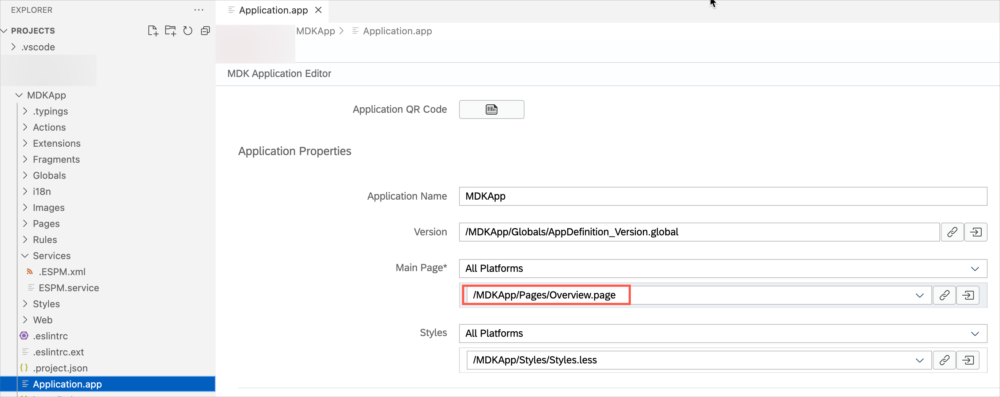

# Exercise 5 - Use Side Drawer Navigation for your application

In this exercise you will create a new page using Side Drawer Navigation page type and will add side drawer items to display the information.

- [Exercise 5 - Use Side Drawer Navigation for your application](#exercise-5---use-side-drawer-navigation-for-your-application)
    - [Exercise 5.1 - Create a Side Drawer Navigation Page](#exercise-51---create-a-side-drawer-navigation-page)
    - [Exercise 5.2 - Add additional items to Side Drawer Section](#exercise-52---add-additional-items-to-side-drawer-section)
    - [Exercise 5.3 - Set the first page as the overview page](#exercise-53---set-the-first-page-as-the-overview-page)
    - [Exercise 5.4 - Redeploy the application](#exercise-54---redeploy-the-application)
    - [Exercise 5.5 - Update the MDK app with new metadata](#exercise-55---update-the-mdk-app-with-new-metadata)
  - [Summary](#summary)

### Exercise 5.1 - Create a Side Drawer Navigation Page

Side Drawer Navigation page provides a slide out menu navigation option and can be used to provide the similar functionality to the Bottom Navigation page type but supports more than 5 areas within your application. This page type can only be used as the `MainPage` in the `Application.app`.  

1. In SAP Business Application Studio project, right-click the `Pages` | `MDK: New Page`.

    
   
2. Select `Side Drawer Navigation Page` and click `Next`.

    

3. Enter the `Page Name` as **Overview** and click `Next` and the `Finish` on the confirmation step.

    

   The generated page has a default Side Drawer Header and a section.
   
    

  In next step, you will update the default page schema and add some additional Side Drawer sections.

4. Select the Header area and click on the `link` icon for the **Headline** property to open the Object Browser. Choose **Control & Client Data** in the dropdown and double-click on the `UserId(Value)`. Click **OK** to set the value in the control field.

    

    >`#Application/#AppData/UserId` will return the `UserId` of current user. You can find more information about such target path in this [documentation](https://help.sap.com/doc/f53c64b93e5140918d676b927a3cd65b/Cloud/en-US/docs-en/guides/getting-started/mdk/development/property-binding/target-path.html#targeting-properties-on-applications-appdata-and-clientdata-object).

5. For other properties, provide below information: 
   
    | Property | Value |
    |----|----|
    | `IconIsCircular`| true |
    | `SubHeadline`| Remove the default value and leave it blank |

    

6. Select `Item0` on the page preview. In `Properties` pane, under the `Data` section, click the expand node for `Item0` and provide the below information in the Properties pane to display Customers list. 

    | Property | Value |
    |----|----|
    | `Image`| sap-icon://customer |
    | `Name`| Customers |    
    | `PageToOpen` | click on the 3 dots icon, select the `Object Browser` and bind it to *Customers_List.page* |    
    | `Title`| Customers |

      

    You will now see the Side Drawer Section item is now bound to Customers.     

    

### Exercise 5.2 - Add additional items to Side Drawer Section

You will now add additional items to display other info.

1. Click the **Add** button and add 3 more items.  

    You should now have total 4 items.

    

2. Provide the below information for the second item in the Properties pane to display Products list:  

    | Property | Value |
    |----|----|
    | `Image`| sap-icon://product |
    | `Name`| Products |    
    | `PageToOpen` | click on the 3 dots icon, select the `Object Browser` and bind it to *Products_List.page* |    
    | `Title`| Products |

    

3. Provide the below information for the third item in the Properties pane to display Suppliers list: 

    | Property | Value |
    |----|----|
    | `Image`| sap-icon://supplier |
    | `Name`| Suppliers |    
    | `PageToOpen` | click on the 3 dots icon, select the `Object Browser` and bind it to *Suppliers_List.page* |    
    | `Title`| Suppliers |

    

4. Provide the below information for the fourth item in the Properties pane to display Sales Orders list: 

    | Property | Value |
    |----|----|
     | `Image`| sap-icon://sales-order |
    | `Name`| SalesOrders |    
    | `PageToOpen` | click on the 3 dots icon, select the `Object Browser` and bind it to *SalesOrderHeaders_List.page* |    
    | `Title`| Sales Orders |

    

    The Overview page layout should look like below:

    

### Exercise 5.3 - Set the first page as the overview page

In the template generated project, there is already a page called *Main.page* which is also the page that opens after successful onboarding. For this exercise, you will change the default behavior of the app launch binding it to the *Overview page*. Please note that Side Drawer Navigation page type can only be used as the MainPage in the Application.app, you cannot open it being on any other page.

1. Click the `Application.app` file, select the **Overview.page** for the `Main Page` property.

    

### Exercise 5.4 - Redeploy the application

1. Right-click the `Application.app` file in the project explorer pane, select `MDK:Deploy` and then select deploy target as **Mobile Services**.

    
    

    >Alternatively, you can select *MDK: Redeploy* in the command palette (View menu>Command Palette OR press Command+Shift+p on Mac OR press Ctrl+Shift+P on Windows machine), it will perform the last deployment.
    >

### Exercise 5.5 - Update the MDK app with new metadata

Tap **Update** on the Main page, you will see a _New Version Available_ pop-up, tap **Now**. 
You will now see the main page as the Overview page where your First Name, Last Name and User Id are displayed in the header section and a section with various items to navigate across different areas to see the page content.

  Android             |  iOS
:-------------------------:|:-------------------------:
  |  
  |  

## Summary

You've now the Side Drawer Navigation page as the Main page to navigate within the application.

Continue to - [Exercise 6 - Add a User Menu Section to the application](../ex6/README.md)