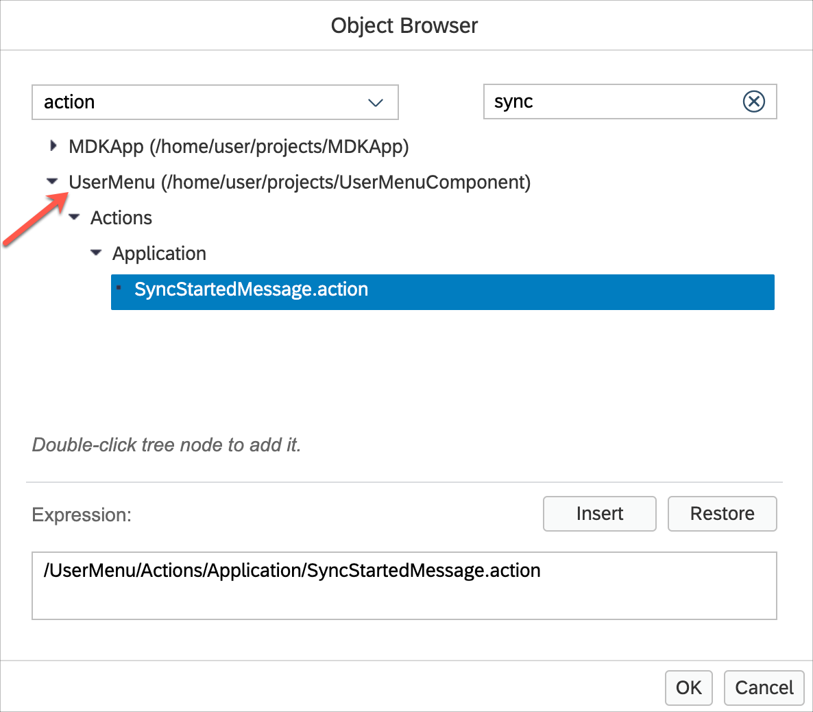

# Exercise 6 - Add a User Menu Section to the application

In this exercise we will add a User Menu section to the Overview page of the application. Since the functions on the User Menu are generic in nature and can apply to almost any MDK application, the User Menu has been pre-created and will be added into the application as an MDK Component.

- [Exercise 6 - Add a User Menu Section to the application](#exercise-6---add-a-user-menu-section-to-the-application)
    - [Exercise 6.1 - Copy the UserMenuComponent application into your workspace](#exercise-61---copy-the-usermenucomponent-application-into-your-workspace)
    - [Exercise 6.2 - Copy Configuration from Component application into Base application and Modify them](#exercise-62---copy-configuration-from-component-application-into-base-application-and-modify-them)
    - [Exercise 6.3 - Update the Reference Applications](#exercise-63---update-the-reference-applications)
    - [Exercise 6.4 - Create a CIM file for the User Menu Component](#exercise-64---create-a-cim-file-for-the-user-menu-component)
    - [Exercise 6.5 - Add the Side Drawer User Menu section](#exercise-65---add-the-side-drawer-user-menu-section)
    - [Exercise 6.6 - Redeploy the application](#exercise-66---redeploy-the-application)
    - [Exercise 6.7 - Update the MDK app with new metadata](#exercise-67---update-the-mdk-app-with-new-metadata)
  - [Summary](#summary)

The User Menu contains the following items.

| Menu Option | Description |
  |----|----|
  | `Sync Changes` | This option is only applicable to offline applications. It allows uploading any local changes from Mobile client to backend and also download any delta from backend to mobile client |
  | `Support` |  The Support option provides an easy way for users to contact support through the use of a contact cell.  The contact information is defined in globals.  The Activity Log option on the Support page allows the user to turn on/off client logging, set the log level, and if enabled in the Mobile Services application, also upload the current client logs. |
  | `Check for Updates`  |   This option will check if new Metadata has been deployed to Mobile Services App Update.  If new Metadata is found, it will be downloaded and prompt the user to apply the changes. |
  | `About` |  The About page displays the current user / device id along with the Application Name, Metadata version and Client version information |
  | `Reset` |  This option will completely reset the client.  This will erase any downloaded data and application Metadata and return the user to the Welcome screen. |

### Exercise 6.1 - Copy the UserMenuComponent application into your workspace
Since the User Menu requires setting some configuration options, we will copy the component into our workspace

1. Expand the session repository `teched2022-AD181` | `exercises` | `ex6` folder
2. Right-click on the **UserMenuComponent** folder and select `Copy`.
   
    

3. Collapse the project folders in the Explorer pane.  Right-click below all the project folders in the empty space in the Explorer pane and select `Paste` to paste the *UserMenuComponent* into the workspace as a new folder.

    

    

### Exercise 6.2 - Copy Configuration from Component application into Base application and Modify them 

The User Menu Component has been designed to be used in different applications. In your Base application, you will reuse existing configurations from your component application and will configure them according to your requirements.

1. Expand the  `UserMenuComponent` project | `Globals`. Right-click on `Application` folder, Copy it.

    

2. Under `MDKApp`, right-click on `Globals` and paste it there. 

    

3. Let's start modifying these configurations. In `MDKApp` | `Globals` | `Application` folder, select `ApplicationName.global` and edit the value to be the user-friendly name of your application.

    

4. On the Support page, the user has options to contact support via Phone, E-Mail and FaceTime. Select `UserSupportEmail.global` and set the Value to the e-mail address for user support inquiries.

    

5. Select `UserSupportFaceTime.global` and set the phone number for user face time support inquiries.  This is only applicable for iOS devices.

        

6. Select `UserSupportPhone.global` and set the Value to the phone number for user support inquiries.

    

7. Select `AppDefintion_Version.global` and edit the version number for your application metadata (if desired).

    

### Exercise 6.3 - Update the Reference Applications

When working with MDK Component applications, in order to validate entries and allow selection of objects from the component, the applications need a reference to the other application.

We will define the reference applications entry in both the `MDKApp` and `UserMenuComponent` application. The setting has no effect at runtime on the client. 

1. Expand the `MDKApp` application folder and select the `Application.app` to open the MDK Application Editor.

    

2. Scroll down to the Reference Applications section and click the Add button in the table header.

    

3. In the Object Browser, double-click on your component application project to set it in the Expression area and click `OK` to save the change.

    

4. Close the Application.app editor window.

    

    You will repeat this process in the MDKApp application as well.

5. Expand the `UserMenuComponent` folder and select `Application.app` to open the MDK Application Editor.

    

6. Scroll down to the Reference Applications section and click the Add button in the table header.

    
    
7. In the Object Browser, double-click on your MDK application project to set it in the Expression area and click `OK` to save the change.

    

8. Close the Application.app editor window.

    

### Exercise 6.4 - Create a CIM file for the User Menu Component

In order for the User Menu Component application to be included when deploying the `MDKApp` application, and to specify the overrides from the `MDKApp` application into the `UserMenuComponent` application, a CIM file is needed in the `MDKApp` application.

1. Right-click the `Application.app` file in the `MDKApp` project in the explorer pane and select `MDK: New CIM`

    

2. Provide the required information and click **Next** and then click **Finish**.

    | Field | Value |
    |----|----|
    | `Project Name` | Select **UserMenuComponent** from the drop-down |
    | `Application Name` | Select **UserMenu** from the drop down |
    | `CIM File Name` | Leave as the default value |

    

3. In the Integration Points table header, click the `Add` button and select `Action` from the menu.

    

4. For the `Source` file, click on the `link` icon to open the object browser.

    

5. Type `sync` in the search field and double click on the `SyncStartedMessage.action` from the `MDKApp` to set it in the Expression and click `OK`.    

    

6. For the Target file, open the object browser, type `sync` in the search field and double click the `SyncStartedMessage.action` from your `UserMenu` Application to set it in the Expression and click `OK`.

    

7. Click the `check` button to create integration point.

    
    

8. Similarly, override the Global variables. 
In the Integration Points table header, click the `Add` button and select `Global` from the menu.  

    

9. For the `Source` file, click on the `link` icon to open the object browser.

    

10. Double click the `AppDefintion_Version.global` from the `MDKApp` to set it in the Expression and click `OK`.    

    

11. For the Target file, open the object browser and double click the `AppDefintion_Version.global` from your `UserMenu` Application to set it in the Expression and click `OK`.

    

12. Click the `check` button to create the integration point.

    
      

13. Similarly, add integration points overriding the other Global variables `ApplicationName.global`, `UserSupportEmail.global`, `UserSupportFaceTime.global` and `UserSupportPhone.global`.

     

### Exercise 6.5 - Add the Side Drawer User Menu section

The Side Drawer User Menu section next needs to be added to the `MDKApp`.

Open the `Overview.page` and drag & drop an `SideDrawerUserMenuSection` Fragment from the Controls palette to the left side of the action bar for the Customers page.

### Exercise 6.6 - Redeploy the application

1. Right-click the `Application.app` file in the project explorer pane, select `MDK:Deploy` and then select deploy target as **Mobile Services**.

    
    

    >Alternatively, you can select *MDK: Redeploy* in the command palette (View menu>Command Palette OR press Command+Shift+p on Mac OR press Ctrl+Shift+P on Windows machine), it will perform the last deployment.
    >

### Exercise 6.7 - Update the MDK app with new metadata

| Steps      | Android | iOS     |
| :---        |    :----:   |          ---: |
| 1. Re-launch the app on your device, authenticate with passcode or Biometric authentication if asked. you will see a _New Version Available_ pop-up, tap **Now**. |        |    |
|2. You will now see that the Overview page now has a user menu section.  |        |    |

## Summary

You've now added the User Menu MDK Component to your application.

Congratulations, you have completed the SAP TechEd 2022 session *DEV181 – Compose Enterprise-Grade Mobile Apps on SAP BTP.*

To continue your Mobile Development Kit learning, visit the resources under the [Additional Support and Learning Resources](../../README.md#additional-support-and-learning-resources) section.